# 豆芽

[English version](README-en.md)

> Douban, Yet Another.

另一个 Material Design 的豆瓣客户端。


<!--<a href="https://play.google.com/store/apps/details?id=me.zhanghai.android.douya" target="_blank"></a>-->

下载：[豆芽稳定版本](https://github.com/zhanghai/Douya/releases/latest)

[豆芽 CI 构建](https://github.com/zhanghai/DouyaCiBuilds)

[豆芽 API Key 设置向导](https://github.com/zhanghai/DouyaApiKey)

## 部分特性

- Material Design
- 首页友邻广播
- [启动速度优化](#启动速度)
- [界面动画](#界面动画)
- [支持屏幕旋转](#屏幕旋转)
- [平板多列视图](#平板适配)
- 支持使用 Custom Tabs 打开网页
- 支持切换长/短链接显示

## 预览

图片：

<p>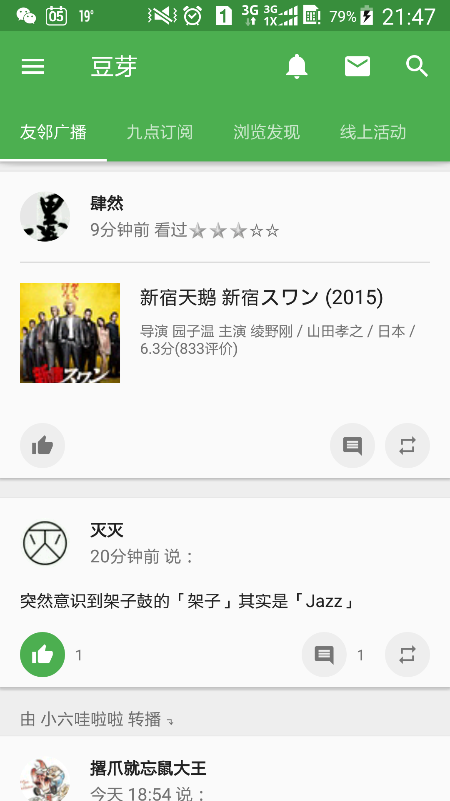
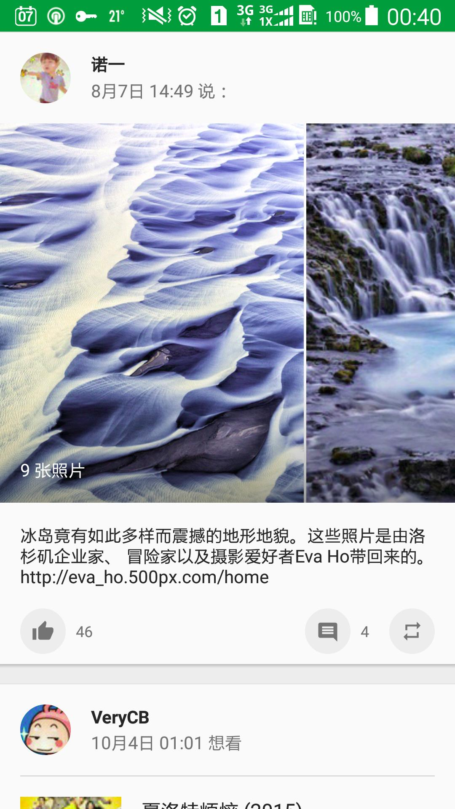
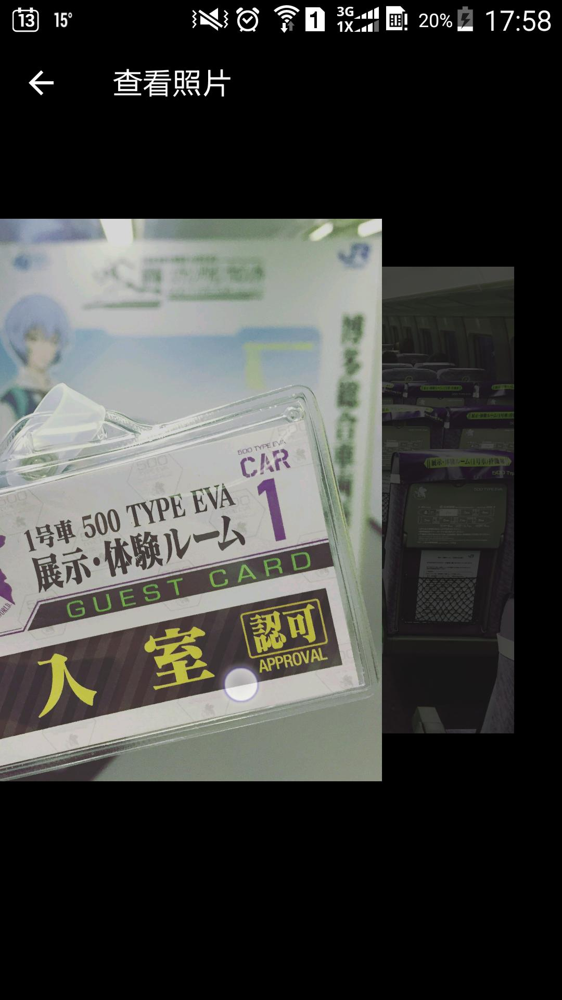
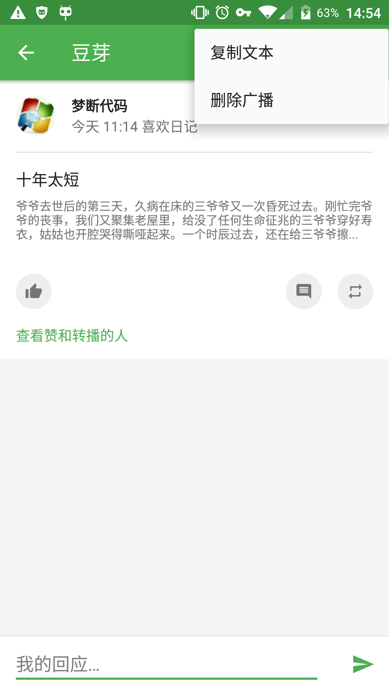
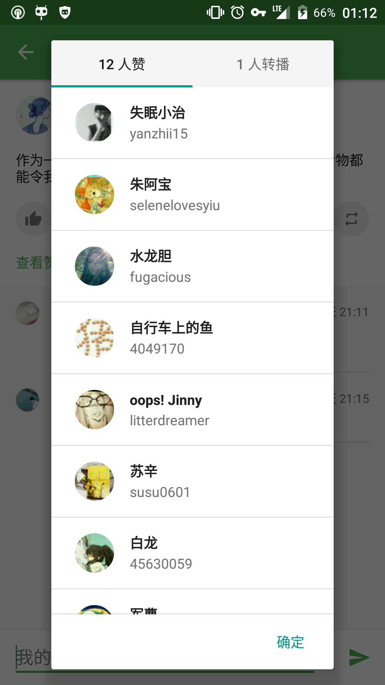
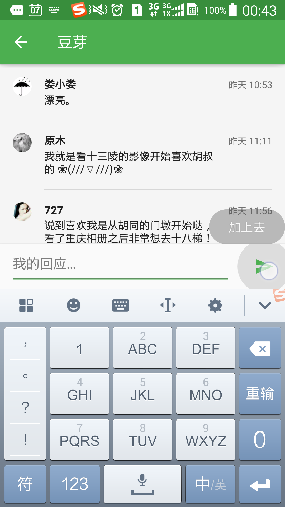
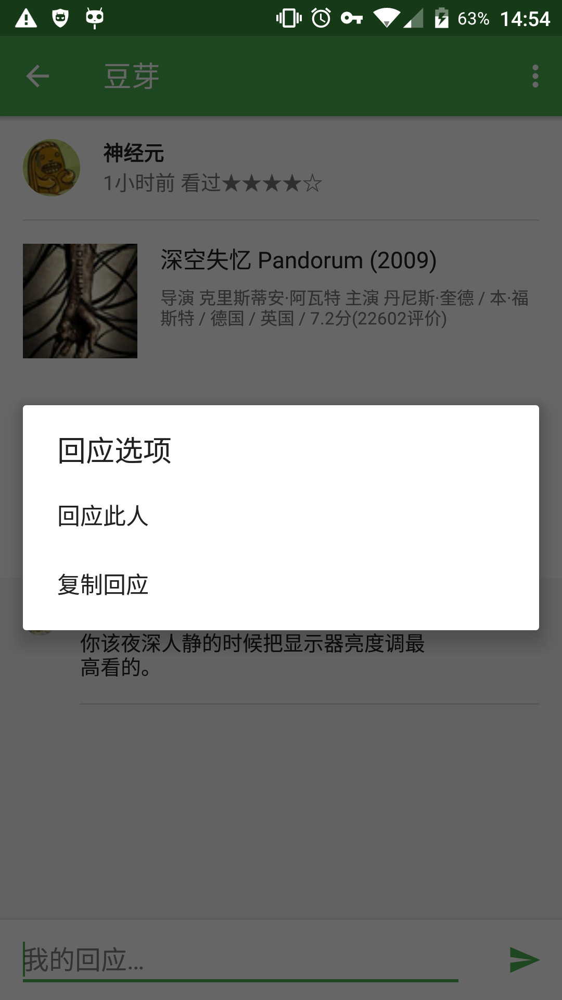
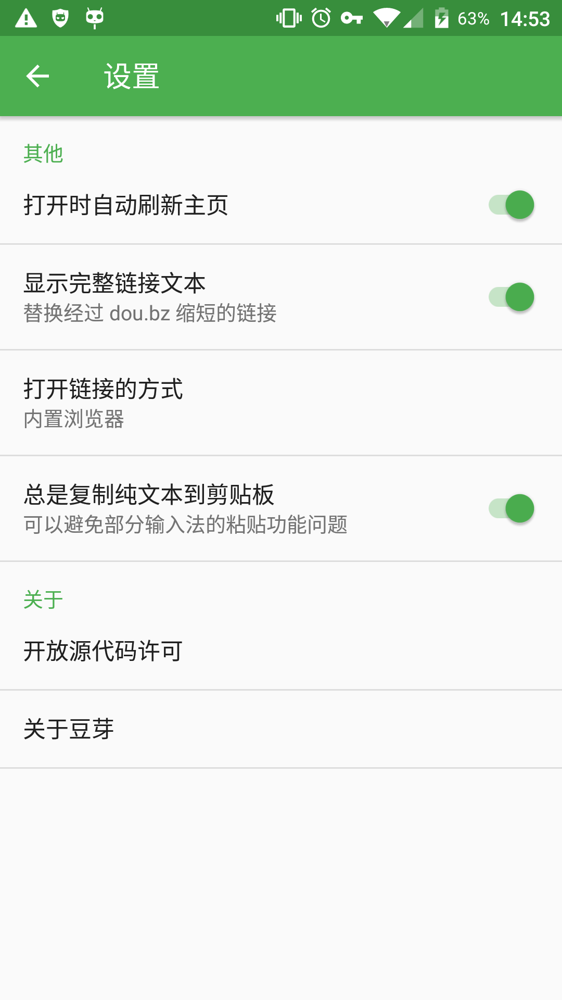
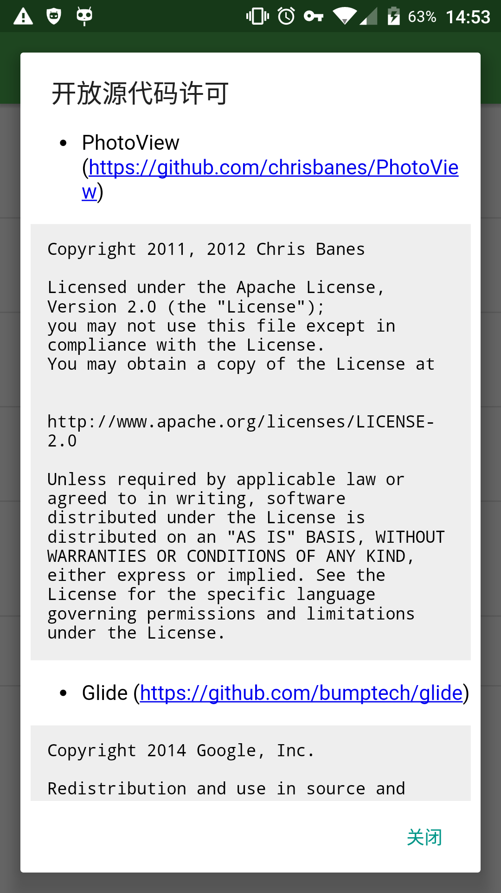
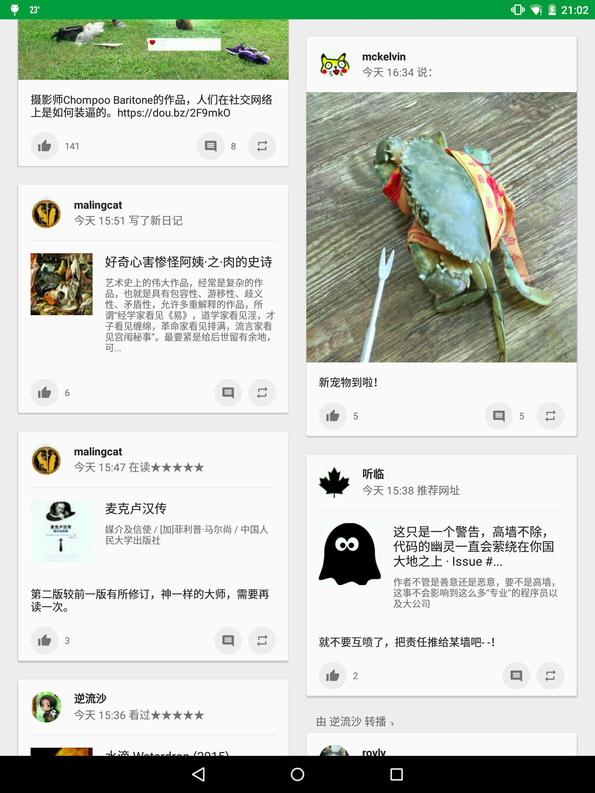
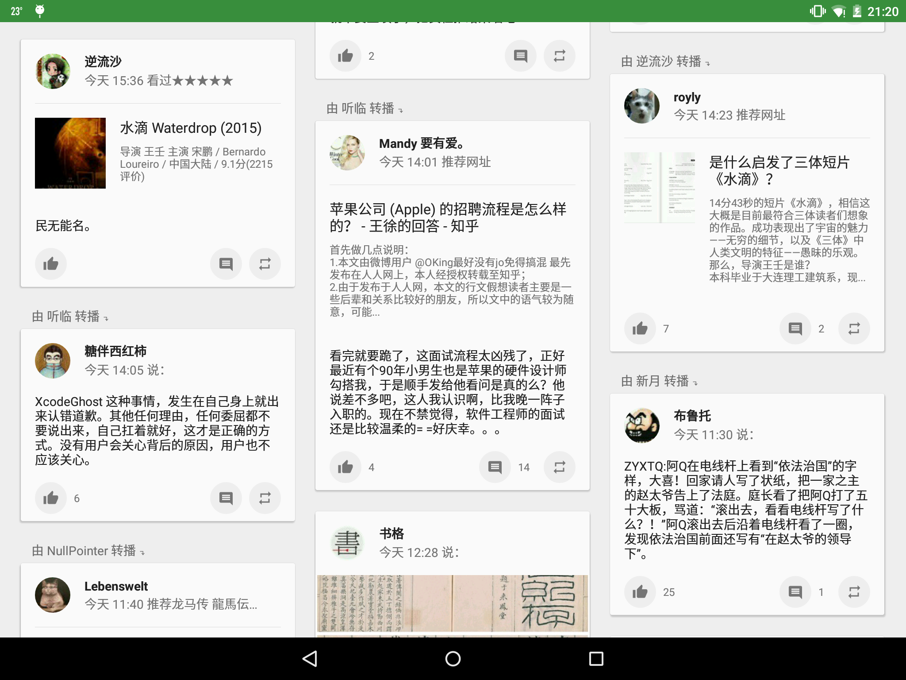</p>

视频：

- [优酷链接](http://v.youku.com/v_show/id_XMTQyMDE5ODk0MA==.html)
- [Vimeo 链接](https://vimeo.com/156952508)

## 关于名字

豆芽的名字取自“Douban, [Yet Another](https://en.wikipedia.org/wiki/Yet_another)”的缩写和中文词语“豆芽”的拼音正好相同的巧合。

取名之后，我才得知豆瓣的 Windows Phone 客户端的名字也叫做“豆芽”。所以相对于豆瓣官方应用“[一个叫‘豆瓣’的App](http://blog.douban.com/douban/2014/08/08/2897/)”，也正好将这个应用称为“另一个叫豆芽的应用”了。

## 为什么要有豆芽？

> 直接访问豆瓣的所有人里，最普遍而一致的用法是围绕电影、电视、书、唱片、活动(我们叫做”条目”的东西)的评分评论、发现和讨论。我们会把和网站同步的评分评论作为一个起点和基础，在手机上重新构建围绕个人兴趣的发现和讨论。
>
> 一个叫“豆瓣”的App——豆瓣日志

豆瓣从来不是一个单一的网站，而对于豆瓣的用法自然不尽相同。使用豆瓣是为了获取信息，但信息的获取是基于条目和算法，还是基于友邻和人，这个问题在豆瓣的多次改版中大概一直悬而未决。

这次，一个叫“豆瓣”的应用选择的是基于条目的推荐。但我个人作为一个重度豆瓣用户，重视的却恰好是基于人的推荐，喜欢的是友邻间的鸡犬相闻，以及闲逛时从条目评论、广播、日记中发现新友邻的惊喜。正如我在某次“还我旧版”运动中听到的声音，“不管怎么改版，只要友邻们还在就好”，改版是豆瓣不断良好发展的必经之路，但这句话中对友邻的珍重又令我感受到了豆瓣最宝贵的特质。

豆瓣作为一个工具的价值可以通过条目很好体现，但豆瓣作为一个独一无二的社区，只能通过它独有的、克制的、以人为本的方式才能维系。作为一个普通但也深爱豆瓣的用户，我希望豆瓣在这个方向上也不要失落，因为一个只有工具属性的网站对我而言将再也没有这样的归属感。

我在这一点上与豆瓣应用有了不同的追求，并且恰好有一些这方面的能力，又恰好豆瓣提供了开放的 API，于是就想要将这个想法实现出来了。

选择开始豆芽这个项目，还有一个原因是我希望在豆瓣继续看到平台原生的设计。

豆瓣广播在几年前就已经是国内少有的几个 Android Design 的应用，这一点一直令我钦佩和喜爱。在豆瓣应用最开始的版本中，也曾有过 Material Design 的尝试，但随着和 iOS 风格设计的杂糅，逐渐显得不合时宜，以至于最终选择了完全的 iOS 风格。我对此一直感到有些遗憾，况且 Material Design 也是一款更加优秀的设计语言。所以，我希望实现未能见到的另一种可能性。

## 指导原则

豆芽的最终目标是为豆瓣中基于友邻的信息获取方式提供在移动端的便利。为了优雅地实现这个目标，豆芽将主要遵循以下的原则：

- 遵循 Material Design 规范，且指导思想优先于细节规定。
- 像素完美，但更注重以人为本。
- 实现精确，代码可以自我辩护。
- 行为合格，支持屏幕旋转和平板布局。
- 功能崇尚简约，不打扰用户。
- 行为默认值合理，且用户可调节。
- 积极表现豆瓣特性，如广播、友邻、豆邮等。
- 通过细节设计，提倡用心、考虑到他人的内容。

规则可以被打破，但前提是理解规则。

## 功能架构

豆芽的架构将与当前网站的设计十分类似。

你可能会问，难道豆芽只是要做一个豆瓣网站的移动端界面么？并非如此。豆芽的最终目标是为基于友邻的信息获取方式提供便利，所以架构设计也是为此服务。而架构与当前网页端设计基本相同，则是因为现在网页端正是一个符合这个目标的设计，并且与移动端的导航也可以很好地契合。

让我们详细地规划一下豆芽吧。

导航采用抽屉一级导航 + 选项卡二级导航的方式。工具栏上将显示全局的动作。

- 工具栏
    - 提醒：所有类别的提醒，可以查看历史提醒
    - 豆邮：用户间的邮件往来，希望鼓励郑重而非聊天。
    - 搜索：立即访问想要的内容。
- 用户：点击后显示个人页面，相当于“我的豆瓣”。
- 首页
    - 友邻广播：友邻互动、友邻推荐、系统定制的推荐。
    - 九点：友邻的日记、博客文章等，有深度的内容。
    - 一刻：全站范围的热门内容推荐。
    - 同城：基于地理位置的内容。
    - 线上活动：基于共同兴趣的内容。
- 读书
    - 分类浏览、首页推荐：入口，以及最有可能发现新内容的地方。
    - 我读：管理自己的读书标记、创造内容。
    - 动态：查看友邻的阅读动态，互动、获得推荐。
    - 豆瓣猜：基于算法的推荐。
- 电影
    - 类似读书。
- 音乐
    - 类似读书。
- 设置：提供应用设置等。

在子页面设计中，豆芽将尽量鼓励长内容和用心的互动。因为我相信只有豆瓣值得这样尝试。

## 实现状况

我在最初的二十天内冲刺实现了应用的网络层、账户系统等基础架构，和查看友邻广播需要的大部分功能，大约 8000 行代码。

在接下来的八十天中，由于课业、其他事情和速度瓶颈，实现过程有所减慢。但是，应用的细节功能和界面交互都正在不断地被实现和优化。代码量达到了 14000 行，同时为此应用而写作的多个开源库的数千行代码并没有被计入。

此后项目经历了大型的重构，以适应代码复用和支持屏幕旋转的需求。在此之后，我得以实现了一个较为美观的个人资料页，并且对应用的许多细节进行了完善。

目前实现了原“豆瓣广播”应用的大部分功能。剩下的工作也正在继续进行中。

## 实现架构

### 数据层面

应用除了对少数内容进行缓存，其他内容均直接从网络获取。

- 基于 Android 账户系统提供用户账户和身份认证。
- 使用 Retrofit 及部分自定义增强处理网络请求。
- 使用 Gson 自动填充数据模型。
- 使用 Glide 加载图片。
- 使用 DiskLRUCache 及自定义增强对首页数据进行缓存。
- 使用 EventBus 同步不同页面间对象状态。

### 界面层面

使用 Support Library 中的 AppCompat、Design、CardView、RecyclerView 进行 Material Design 实现，在必要时引入/自己写作第三方库以实现部分界面元素和效果。

使用框架的 Shared Element Transition 实现在 Android 5.0 以上的界面过渡动画。

界面实现一般分为 Activity、Fragment、Adapter 三个模块，分别负责作为容器，发起请求、展示数据和用户交互，以及数据/交互绑定。

## 实现难点

### 网络请求

Retrofit 本身已经较为强大，而在豆芽中则对 Retrofit 进行了包装，增加了认证和错误处理等功能，为之后 API 层建立提供了很多方便。

### 磁盘缓存

DiskLRUCache 是一个只实现了同步读取写入的库，因此豆芽对其进行了包装，提供了异步读写的 API，正确实现，提高了应用的响应速度。

### 状态同步

由于各个界面独自获取数据，数据本身与常规的 ContentProvider 机制中不同，是去中心化的，即可能遇到状态不同步的问题。

具体地说，即有可能用户在广播详情界面中点赞后，回到主界面列表视图，发现并未更新状态。

而豆芽解决方案则是使用 EventBus，在请求完成后通知所有界面刷新同一数据。

### 界面动画

Android 5.0 以上提供了 SharedElementTransition，然而默认情况下共享的界面元素在动画时却会被放置在其他界面元素之上，导致其突然越过 AppBar 或 StatusBar 的情况。

通过大量的文档阅读、源代码分析和调试，经过大约一周的时间，最终实现了较为理想的效果。

### 屏幕旋转

Android 在屏幕旋转时，会销毁视图和 Activity 并重建，此时如何保存视图状态和已加载的数据、正在进行的网络请求即是问题。

Android 对部分视图状态提供了自动保存恢复，而豆芽对于其他需要保存的状态则通过自定义的 `onSaveViewState()` 和 `onRestoreViewState()`。

对于数据，豆芽通过自定义的一个无界面的 `RetainDataFragment` 进行数据保留，并且接口十分简单易用。

同时，由于网络请求的异步特性，豆芽通过自定义的一个 `RequestFragment` 实现了网络请求在 Activity 重建期间的保留，并且能够在 Activity 重建完成后将请求前的状态和请求结果回调至新的 Activity。

### 平板适配

Android 本身的资源系统提供了对不同配置的很好支持，通过建立不同的资源文件，即可在手机和平板上使用不同的界面设定。

此外，由于采用了 RecyclerView，通过在运行时判断当前设备配置，可以动态给界面设置为 1、2、3 列视图，充分利用屏幕空间。

### 启动速度

Android 默认在冷启动应用进程至能够调用 `Activity.onCreate()` 前会加载应用主题中的背景作为预览，而默认背景是白色，与应用在上部拥有绿色 AppBar 的效果不相匹配。

为了生成适应于不同屏幕大小、系统版本的图片，我使用 bash 编写了一系列脚本，并实现了一个通用的模板化 SVG 格式，详情见 [MaterialColdStart](https://github.com/zhanghai/MaterialColdStart) 和 [AndroidSVGScripts](https://github.com/zhanghai/AndroidSVGScripts)。

经过自定义窗口背景和其他优化，应用在手机上已经可以达到立即启动的视觉效果。

### 派生开源库

为此项目诞生的五个开源库：

- [MaterialColdStart](https://github.com/zhanghai/MaterialColdStart)，800+ Stars
- [MaterialProgressBar](https://github.com/zhanghai/MaterialProgressBar)，500+ Stars
- [CustomTabsHelper](https://github.com/zhanghai/CustomTabsHelper)，200+ Stars
- [MaterialEditText](https://github.com/zhanghai/MaterialEditText)
- [SystemUiHelper](https://github.com/zhanghai/SystemUiHelper)

## 第三方库

- [PhotoView](https://github.com/chrisbanes/PhotoView)
- [Glide](https://github.com/bumptech/glide)
- [Gson](https://github.com/google/gson)
- [ButterKnife](https://github.com/JakeWharton/butterknife)
- [DiskLruCache](https://github.com/JakeWharton/DiskLruCache/)
- [ThreeTenABP](https://github.com/JakeWharton/ThreeTenABP/)
- [Retrofit](https://github.com/square/retrofit)
- [EventBus](https://github.com/greenrobot/EventBus)
- [CustomTabsHelper](https://github.com/zhanghai/CustomTabsHelper)
- [EffortlessPermissions](https://github.com/zhanghai/EffortlessPermissions)
- [MaterialEditText](https://github.com/zhanghai/MaterialEditText)
- [MaterialProgressBar](https://github.com/zhanghai/MaterialProgressBar)
- [SystemUiHelper](https://github.com/zhanghai/SystemUiHelper)
- [MaterialColdStart](https://github.com/zhanghai/MaterialColdStart)

## 构建

APK 文件可以在本项目的 [Releases](https://github.com/zhanghai/Douya/releases) 中找到。

至于手动构建本项目的基本步骤：

1. 创建 `signing.properties`：

```ini
storeFile=YOUR_STORE_FILE
storePassword=
keyAlias=
keyPassword=
```

2. 执行 `./gradlew build`。

## 使用

安装应用后，请安装 [豆芽 API Key 设置向导](https://github.com/zhanghai/DouyaApiKey) 以设置 API Key。

暂时没有内置的更新渠道，请关注本项目的 Release。

请不要安装从不可靠的来源获取的 APK，以免泄漏您的用户名和密码。

## 许可证

    Copyright 2015 Zhang Hai

    Licensed under the Apache License, Version 2.0 (the "License");
    you may not use this file except in compliance with the License.
    You may obtain a copy of the License at

       http://www.apache.org/licenses/LICENSE-2.0

    Unless required by applicable law or agreed to in writing, software
    distributed under the License is distributed on an "AS IS" BASIS,
    WITHOUT WARRANTIES OR CONDITIONS OF ANY KIND, either express or implied.
    See the License for the specific language governing permissions and
    limitations under the License.
